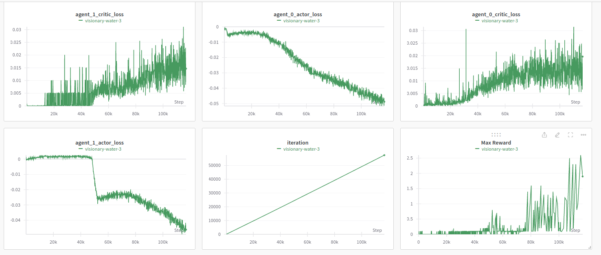
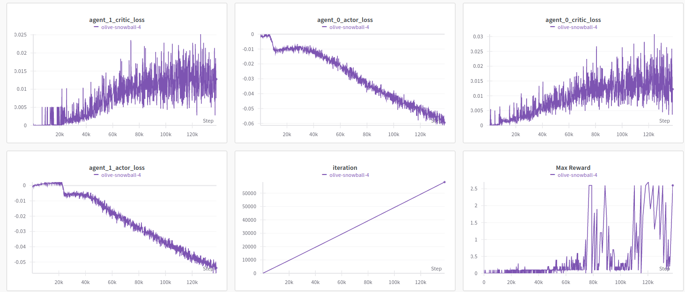

[//]: # (Image References)

[image1]: https://user-images.githubusercontent.com/10624937/42135623-e770e354-7d12-11e8-998d-29fc74429ca2.gif "Trained Agent"
[image2]: https://user-images.githubusercontent.com/10624937/42135622-e55fb586-7d12-11e8-8a54-3c31da15a90a.gif "Soccer"


# Project 3: Collaboration and Competition

### Introduction

For this project, you will work with the [Tennis](https://github.com/Unity-Technologies/ml-agents/blob/master/docs/Learning-Environment-Examples.md#tennis) environment.

![Trained Agent][image1]

In this environment, two agents control rackets to bounce a ball over a net. If an agent hits the ball over the net, it receives a reward of +0.1.  If an agent lets a ball hit the ground or hits the ball out of bounds, it receives a reward of -0.01.  Thus, the goal of each agent is to keep the ball in play.

The observation space consists of 8 variables corresponding to the position and velocity of the ball and racket. Each agent receives its own, local observation.  Two continuous actions are available, corresponding to movement toward (or away from) the net, and jumping. 

The task is episodic, and in order to solve the environment, your agents must get an average score of +0.5 (over 100 consecutive episodes, after taking the maximum over both agents). Specifically,

- After each episode, we add up the rewards that each agent received (without discounting), to get a score for each agent. This yields 2 (potentially different) scores. We then take the maximum of these 2 scores.
- This yields a single **score** for each episode.

The environment is considered solved, when the average (over 100 episodes) of those **scores** is at least +0.5.


### Instructions

Follow the instructions in `Tennis.ipynb` to get started with training your own agent!  

### Quickstart
0. Download the Unity environment: ```bash download_env.sh```
1. I made a few changes Python package dependencies, compared to [Project I](https://github.com/minhna1112/banana-dqn-brain), [Project II](https://github.com/minhna1112/reacher-continuous-control), in which `protobuf==3.20.3` to be compatible with `wandb`.
2.  Run `python3 -m pip install .` in the terminal
3.  Before running the notebook, the environment in the `.env` file should be modified w.r.t to your own `wandb` project and username.
4.  Re-run every cells in [Tennis.ipynb](Tennis.ipynb)

### Solution!!!
Below is my solution for the Tennis task, applying Multi-Agent Deep Deterministic Policy Gradient (MA-DDPG) [[1]][#1].
There will be 2 agents playing tennis, competing against each other.
Both of them are trained using DDPG paradigm [[2]][#2], involving the usage of 2 neural networks: actor who outputs action based on observations and a critic that rates the actions of actor.
The observation space and action space are the same for both actors, with each state vector has a shape of  `[1,24]`  and an action vector of size `[1,2]`.

#### Baseline
1. I use the MA-DDPG base pipeline from [Anh-BK](https://github.com/Anh-BK/drl_collaboration-competition)'s work [[3]][#3]. The original code used TensorboardX for visualization. As promised in the 2 last projects, this time, I tried integrate wandb into the training flow.
2. The project is structured as follows:
- The [agents](agents) folder is used to store the implementations of `DDPG` and `MA-DDPG`
- Each [`DDPGAgent`](agents/ddpg.py) comprises of 2 neural networks: an actor and a critic, with their hyper parameters could be easily configured during initialization.
- The [MA-DDPG](agents/maddpg.py) trains a group of agents to perform a cooperative task in hich the number of agents in the group could be vary by modifying the attribute `num_agents`, which equals 2 for this task.
1. Below is the results after training the baseline for 116768 steps and 1717 episodes:



#### Increase the number of actor layers
1. I try another experiment but with the actors of both agents increasing their [hidden layers](networks/actor_network.py) to 3.
2. The training took longer to converge (20' compared to the previous 15').
3. The actor losses are smoother, but the average scores took more iterations to reach the task 0.5-point requirement.
.
4. After 1575 episodes, the last checkpoint is saved in `checkpoints/episode-1575.pt`

More details about the metrics logged during training the 2 exps could be found [here](https://api.wandb.ai/links/minhna1112/fe4lxm3s)

### Future plan
I want to scale this work over the `Football` challenge, in which the number of agents in the environment increase significantly. That will be my chance to experiment with more sophisticated algorithm such as TarMAC [[4]][#4] 

### References
[1] [MADDPG original paper](https://arxiv.org/abs/1706.02275)

[2] [DDPG original paper](https://arxiv.org/abs/1509.02971)

[3] [Anh-BK Continuous Control](https://github.com/Anh-BK/drl_continuous_control/)

[4] [TarMAC original paper](https://arxiv.org/abs/1810.11187)